# **The Benefits and Limitations of Using Glasp: Social Web Highlighter for Collaborative Research.**

##  **Table of contents**

### Introduction

### Why you need Glass ?

### How to register and install Glasp.

### How to use Glasp.

### Limitation of Glasp

### Conclusion  

#    **Introduction**

### Glasp is a social web highlighter that allows users to collect, highlight, and organize quotes, text, and/or images directly from the webpages into personal account without switching between screens. It automatically save the highlighted items of the webpage. With features like tagging, group sharing, and public highlights, it is simpler to collaborate and share web material with others on Glasp.

#     **Why you need Glasp ?**

### In the current digital era, the internet has developed into a vital resource for researchers, writers, students, and professionals alike. With so much web contents at our fingertips, it can be difficult to keep track of everything we find. In other to keep track and maximize every every piece of content we intend to review, learn or share afterwards while surfing the internet, Glasp is highly recommended. Here are few reasons why you should consider using Glasp:

- **Efficient research:** Without copying and pasting or taking screenshots, you may swiftly highlight and preserve significant information from web pages using Glasp. This can help you focus on the most relevant content while saving you time and effort.
- **Collaboration:** In academic or professional environments where collaboration is vital, Glasp's group sharing tool enables you to work with others on research projects, exchange material with a team, and get feedback from peers as well.
- **Organization:** By categorizing your saved highlights in Glasp using tags, you can later find any specific information. This feature may be extremely helpful when you save a lot of content over time.
- **Automatic Citation:** Referencing research work is very important, Glasp can save you time and effort by citing every highlighted and save words automatically.
- **Public Sharing:** If you wish to share fascinating or educational content with others or create a public repository of study, Glasp also gives you the option to make your highlights public. This features gives room to the general public to see your work, learn and contribute when necessary.

#    **How to register and install Glasp.**

### Follow the steps below to register and install Glasp on your device.

### **To Register an account with Glasp:**

1. Go to your browser and search for [Glasp.co](https://glasp.co/)
   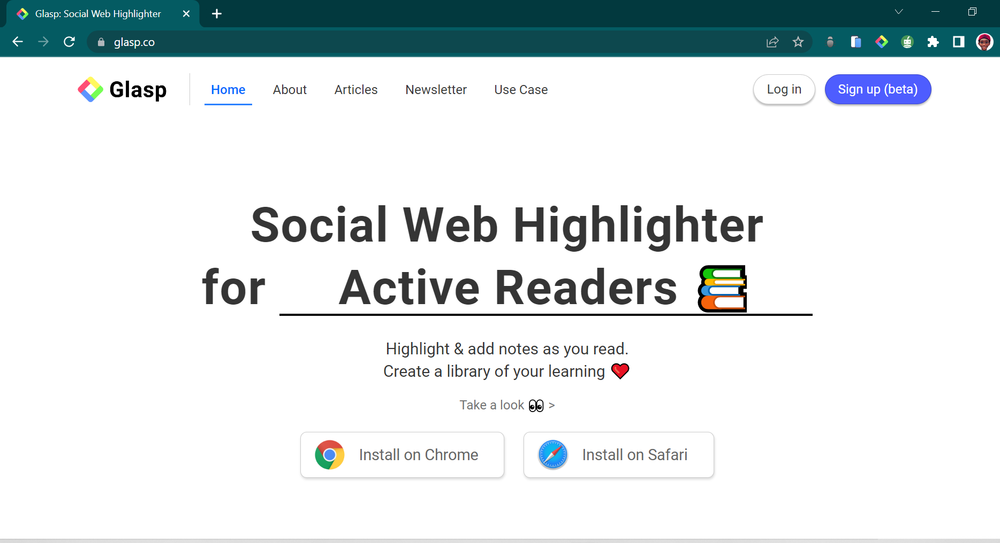

2. Click on the **"Sign up"** button.
   
3. Click on **"Continue with google"** or **"use another account"**
   

### **To Install Glasp:**

1. Click on the **"profile icon"** at the top right corner.

   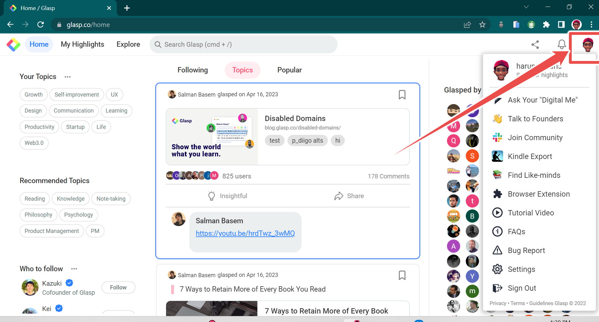

2. Click on **"Browser Extension"** to review the installation option.

   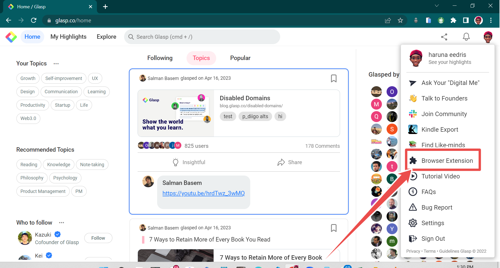

3. Click on **"Add to Chrome"** to install.

   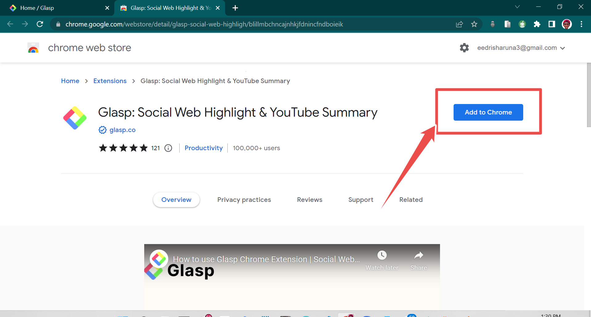

## After successful installation, follow the steps below to pin the extension to the browser's navbar for easy access.

1. Click on the **"Extension Icon"** on your browser.
   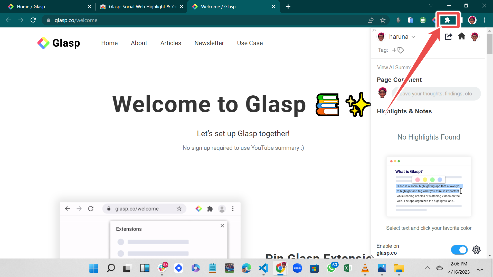

2. Click on the **"pin icon"** in front on the Glasp extension.
   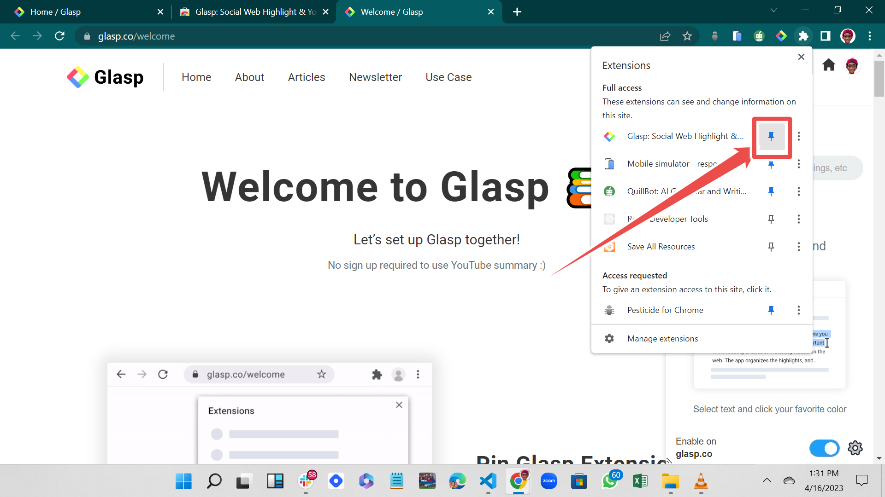

3. The Glasp logo will appear at the top after being pinned.
   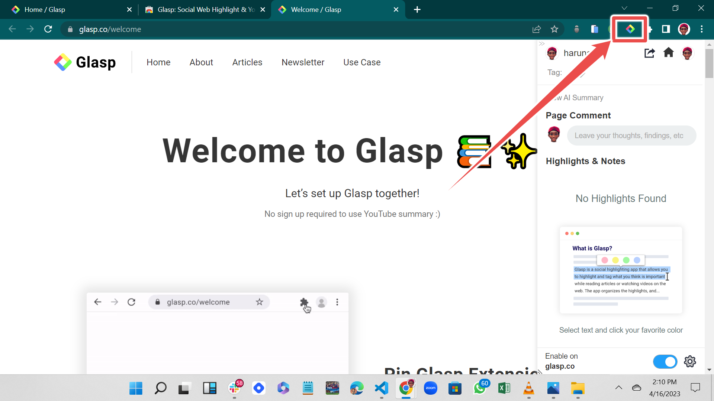

#    **How to use Glasp.**

1. **Highlighting and saving:**
   ### After creating an account successfully, follow the step below to highlight and save your first words using Glasp.

- Highlight the words you want to save from the web page and click on any of the color option.
  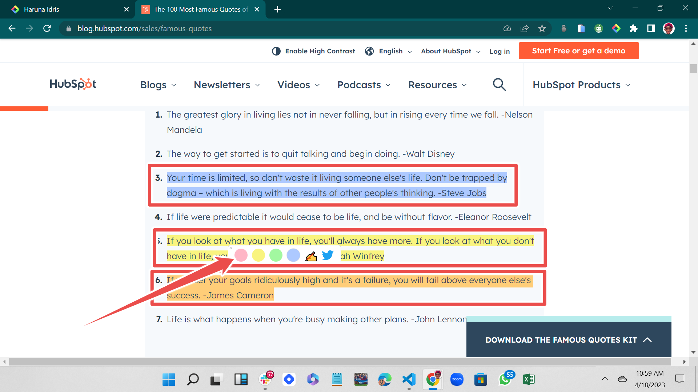

- Click on the extension logo to review all your highlights.
  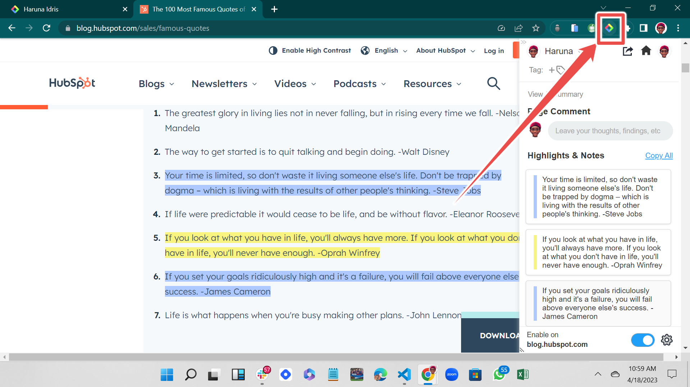

- Click **"My Highlights > Articles"** on your Dashboard to review all your content from different web pages.
  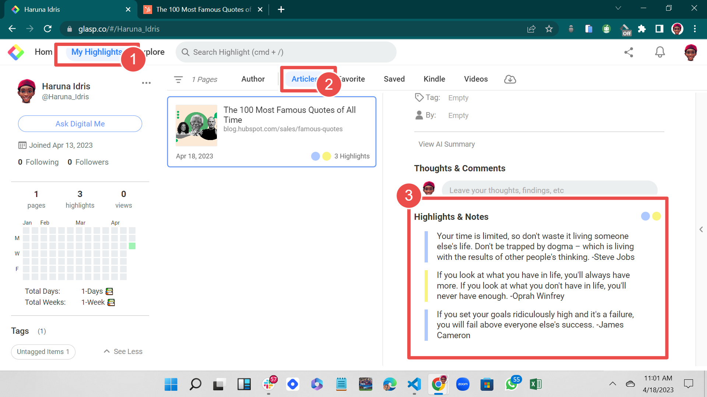

2. **Sharing of content or a specific highlight:**

- Click on the share icon to review the options for sharing a whole content.
  

- click on the **"..."** at the top right of highlight to share a specific highlights to social media, copy highlight links, access embedded code, and delete.
  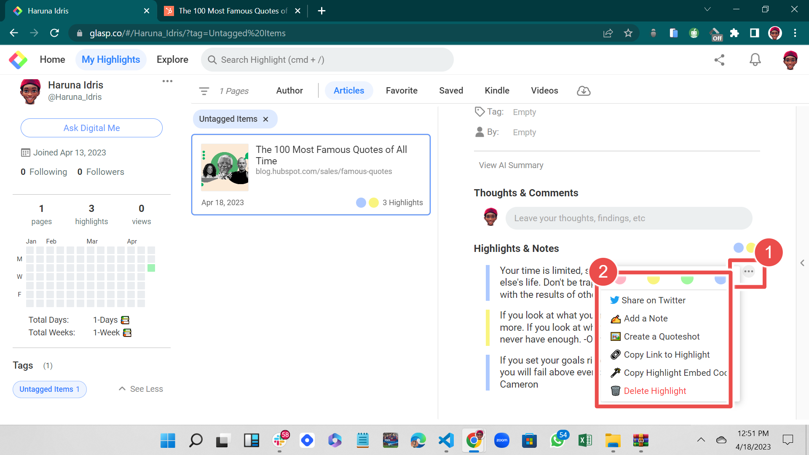

3. Click on the **"copy icon"** to copy all the content of a specific highlight.
   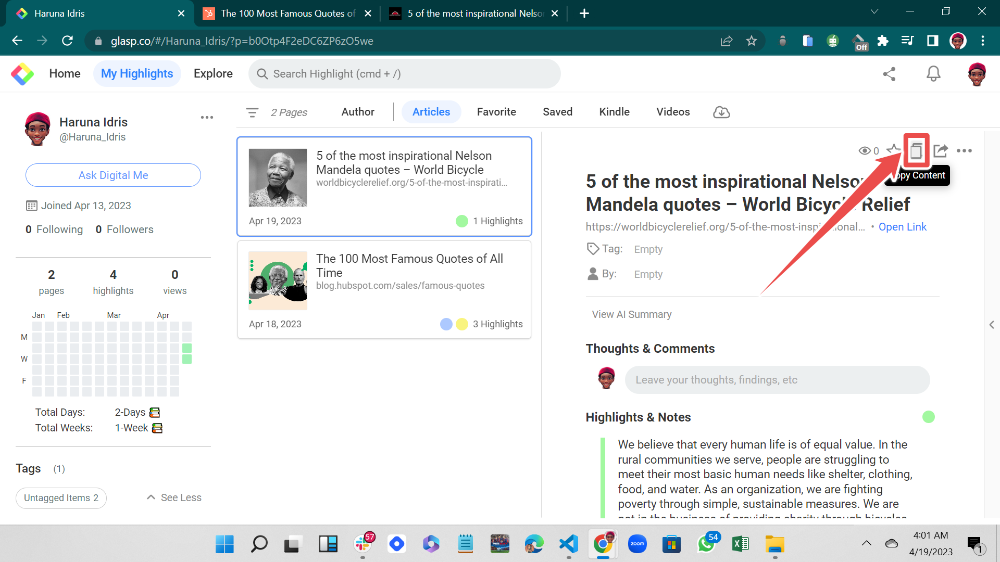

4. Click on the **"Star Icon"** to add the highlight to **"Favorite".**
   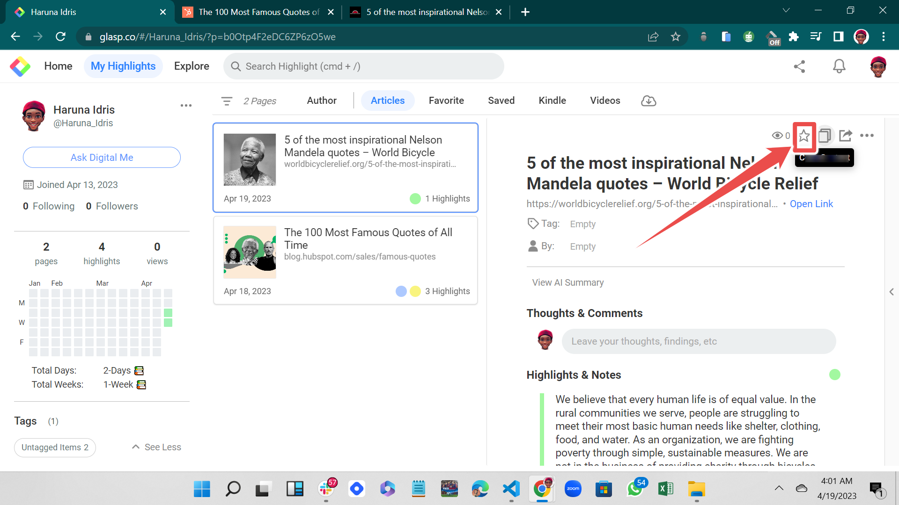

5. Click on the **"•••"** to delete highlight.
   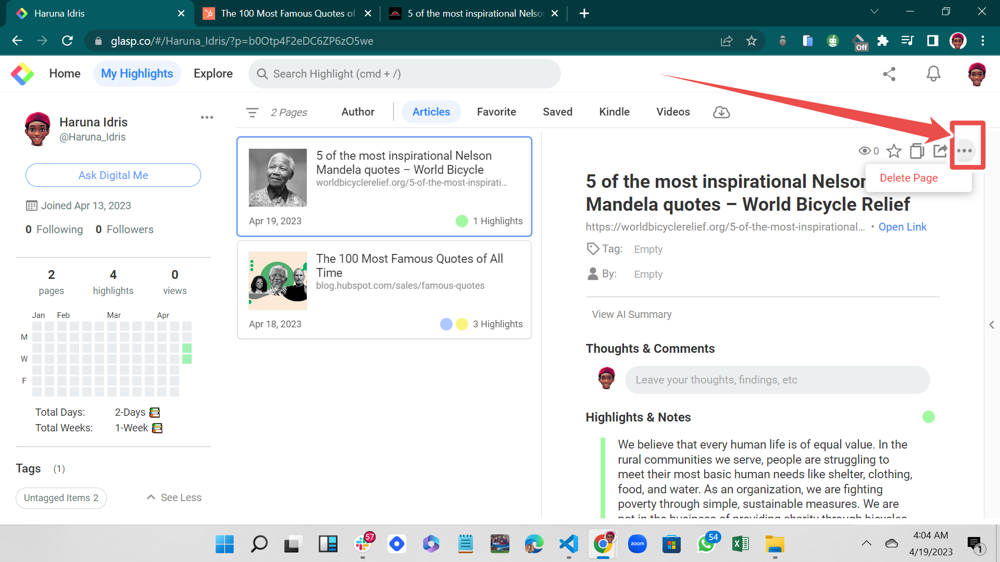

##   **Limitation of Glasp.**

### Despite its exciting features, Glasp also has some limitations. Below are the limitations of Glasp:

1. **Limited storage:** The storage space available for highlights and annotations in Glasp is limited. To make room for new highlights, heavy users may need to occasionally erase older ones.
2. **No mobile app:** There is no mobile app for Glasp; it is solely accessible as a browser extension. Users who desire mobile access to their highlights may find this restrictive.
3. **Limited customization:** Only a few customization choices, including text size and color, are provided by Glasp. For users who wish to personalize their annotations and highlights, this can be a hindrance.
4. **Limited integration with other platforms:** Only a few systems are now supported by Glasp. This can make it challenging to combine Glasp with any other tools you might be using.

##    **Conclusion.**

### Glasp is a strong browser extension that enables users to annotate, highlight, and save web contents. It is a helpful tool for team collaboration and knowledge sharing due to its features, such as group collaboration and Slack integration. It does, however, have certain drawbacks, such as restricted customization and platform integration choices, a lack of a mobile app, and constrained storage. Glasp is nevertheless a helpful tool for web research and cooperation despite these drawbacks, especially for teams working on projects or research.
